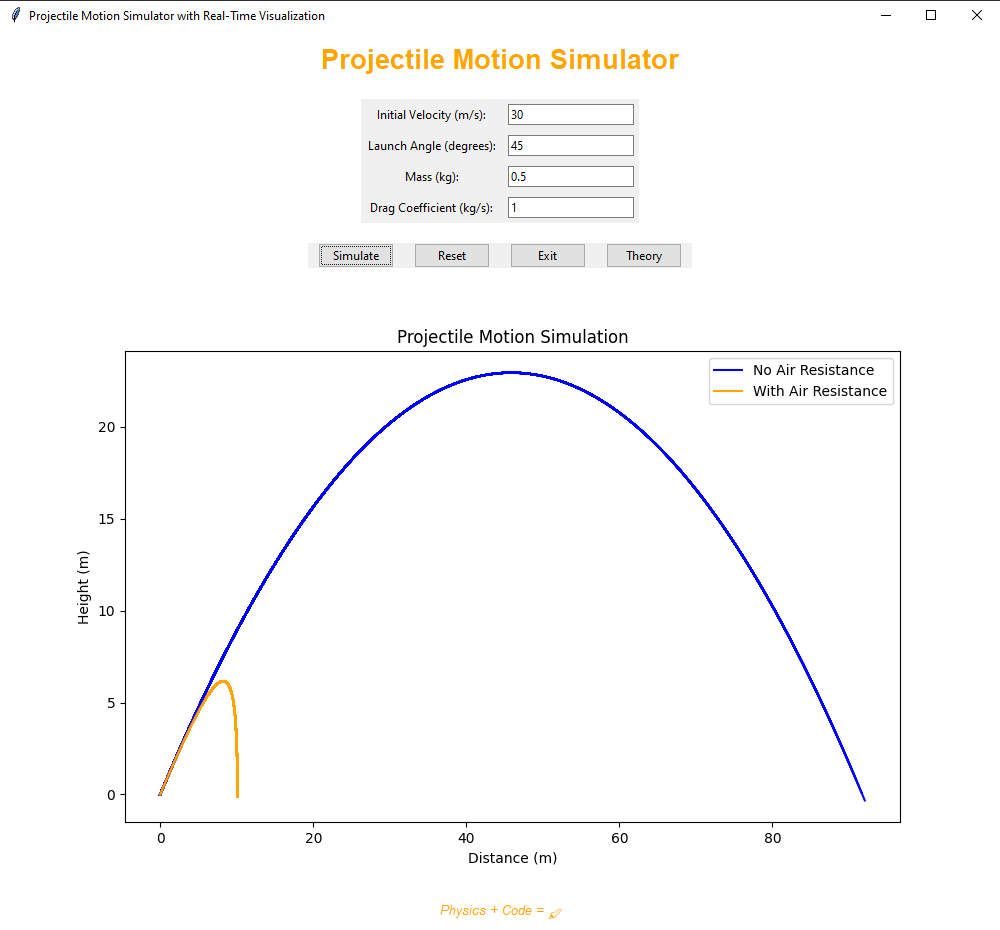

# 🎯 Projectile Motion with Air Resistance Simulator

## 📜 Description

The **Projectile Motion with Air Resistance Simulator** allows users to explore the dynamics of projectile motion while considering the effects of air resistance. Users can input initial conditions such as launch angle, initial velocity, and mass of the projectile, and visualize the trajectory alongside various parameters like range, time of flight, and maximum height.

This simulator is designed for educational purposes, providing insights into the physics of projectile motion and the impact of air resistance on motion trajectories.

## 🚀 Features

- **Adjustable Parameters**: Launch angle, initial velocity, mass of the projectile.
- **Visual Representation**: Dynamic visualization of the projectile's trajectory.
- **Key Metrics Calculation**: Range, maximum height, and time of flight.
- **User-Friendly Interface**: Easy interaction for seamless user experience.
- **Real-Time Graphing**: Track position and velocity over time.

## ⚙️ Installation

To run the simulator, follow these steps:

1. **Clone the Repository**:
   ```bash
   git clone https://github.com/yourusername/projectile-motion-simulator.git
   cd projectile-motion-simulator
   ```

2. **Install Required Packages**:
   ```bash
   pip install -r requirements.txt
   ```

3. **Run the Simulator**:
   ```bash
   python main.py
   ```

## 🖥️ Usage

1. **Input Parameters**: Enter the initial velocity (m/s), launch angle (degrees), and mass (kg) of the projectile.
2. **Start Simulation**: Click the **"Start"** button to launch the simulation.
3. **View Results**: Observe the projectile's trajectory and key metrics displayed on the screen.
4. **Adjust Parameters**: Modify any input parameter and rerun the simulation to see how changes affect the trajectory and metrics.

### 🌟 Example

**Parameters**:
- **Initial Velocity**: 30 m/s
- **Launch Angle**: 45 degrees
- **Mass**: 0.5 kg


After clicking **"Start"**, the trajectory will be displayed, along with calculated metrics such as range and maximum height.
<div align="center"></div>

## 🤝 Contributing

Contributions are welcome! If you have suggestions for improvements or additional features, please fork the repository and submit a pull request. Ensure that your changes are well-documented and include relevant tests.

## 📄 License

This project is licensed under the **MIT License** - see the [LICENSE](LICENSE) file for details.

## 🙌 Acknowledgments

- [Physics Classroom]([https://www.physicsclassroom.com/class/vectors/Lesson-2/Projectile-Motion](https://www.physicsclassroom.com/class/vectors/Lesson-2/Characteristics-of-a-Projectile-s-Trajectory)) - For foundational physics concepts.
- [Open Source Community](https://opensource.guide/) - For guidance and support in developing open-source software.
